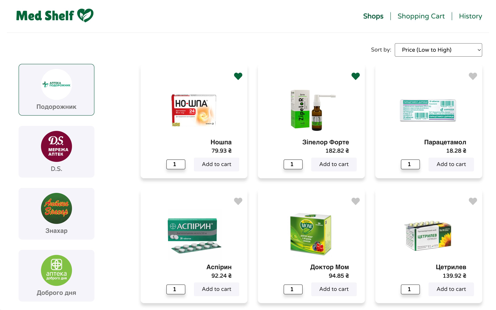
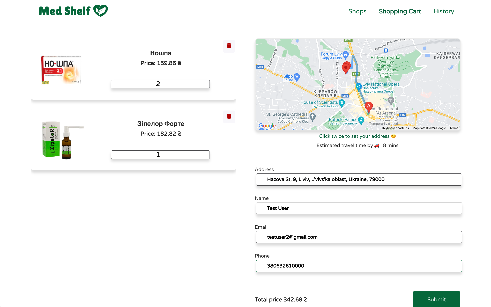
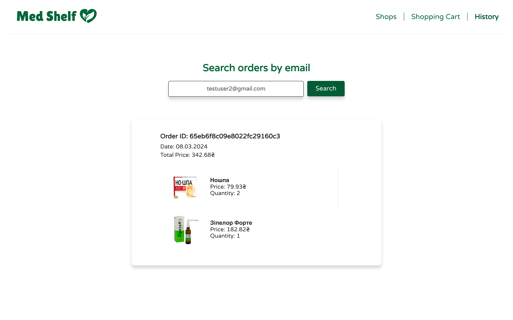

## Med Shelf

This application is designed to streamline the process of purchasing medicines from various drug stores with ease and efficiency.
To see a live demo of my project, visit https://med-shelf.onrender.com

## Features

### Shops page

- Explore Drug Stores: Users can effortlessly browse and select drug stores to view their available medicines.
- Medicine Sorting and Favorites: Enhance your shopping experience by sorting medicines by price, date added, or mark them as favorites for quicker access in future searches.
- Add to Cart: Found what you need? Add your selected medicines directly to your shopping cart with just a click.

### Shopping Cart Page

- Review and Edit Cart: View all added products in your cart. You have the flexibility to remove items or adjust quantities as needed.
- Order Form: To place an order, simply fill in a form with your email, phone number, and address. Our integration with Google Maps allows you to pinpoint your exact location for delivery, showing both your address and the selected shop on the map, including the route and estimated delivery time. The order is saved in the database after the user clicks the “submit” button.
- Local Storage: Your cart is safely stored in local storage, ensuring that your selections are remembered, even if you navigate away.

### History Page

- Order Tracking: Easily track past orders by entering your email, phone number, or order ID. This feature allows users to keep track of their medicine purchases and reorder with convenience.

### Response time
Please mind that because the server is hosted on a free tier at render.com the first response can take some time.
I appreciate your patience :)

## Technology Stack
### Frontend:
- React.js
- Redux Toolkit
- Axios
- Formik
- HTML5
- Sass

### Backend:
- Node.js
- Express
- MongoDB
- Mongoose
- Joi

## To start the project
For starting the project localy, please copy the repo.

### NPM Install:
Use npm -i (npm install) in "server" and "client" folders to download all necessary dependancies for the server and for the frontend.

### Environment Variables
In the "server" and "client" folder, create ".env" files and configure personal environment variables.

### Starting the Server and Frontend:
In "server" folder use "npm start" command to start server. In "client" folder use "npm start" command as well to start frontend part.
